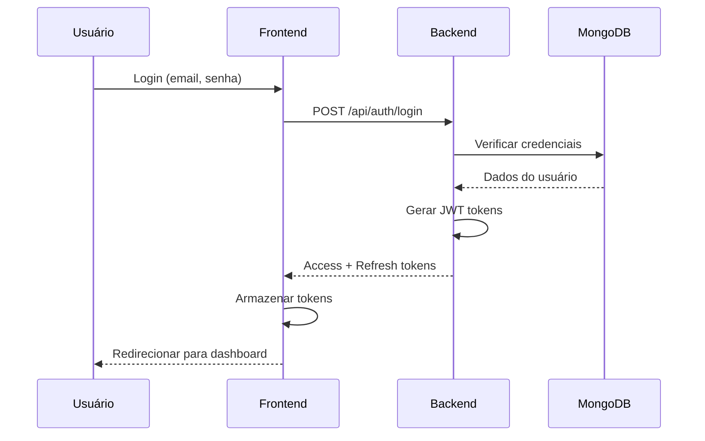

# Arquitetura do Sistema - Alça Hub

## Visão Geral

O Alça Hub é uma plataforma de serviços locais construída com arquitetura moderna, utilizando FastAPI no backend e React no frontend, com MongoDB como banco de dados principal.

## Arquitetura Geral

```
┌─────────────────┐    ┌─────────────────┐    ┌─────────────────┐
│   Frontend      │    │   Backend       │    │   Database      │
│   (React)       │◄──►│   (FastAPI)     │◄──►│   (MongoDB)     │
│   Port: 3000    │    │   Port: 8000    │    │   Port: 27017   │
└─────────────────┘    └─────────────────┘    └─────────────────┘
```

## Componentes Principais

### Frontend (React)

- **Framework**: React 19 com Vite
- **Estilização**: Tailwind CSS
- **Componentes**: Radix UI
- **Animações**: Framer Motion
- **Roteamento**: React Router
- **HTTP Client**: Axios
- **Mapas**: Leaflet
- **QR Codes**: QRCode

### Backend (FastAPI)

- **Framework**: FastAPI (Python)
- **Banco de Dados**: MongoDB com Motor (async)
- **Autenticação**: JWT + bcrypt
- **Rate Limiting**: Implementação customizada
- **Pagamentos**: Mercado Pago
- **Validação**: Pydantic
- **CORS**: Configurado para desenvolvimento e produção

### Banco de Dados (MongoDB)

- **Coleções Principais**:
  - `users`: Dados dos usuários
  - `services`: Serviços oferecidos
  - `bookings`: Agendamentos
  - `payments`: Transações
  - `security_logs`: Logs de segurança

## Fluxo de Autenticação



## Estrutura de Diretórios

```
alca-hub/
├── backend/
│   ├── auth/                 # Módulo de autenticação
│   │   ├── routes.py         # Rotas de auth
│   │   ├── security.py       # Rate limiting e segurança
│   │   └── token_manager.py  # Gerenciamento de JWT
│   ├── tests/                 # Testes
│   │   └── unit/            # Testes unitários
│   └── server.py            # Servidor principal
├── frontend/
│   ├── src/
│   │   ├── components/      # Componentes React
│   │   ├── pages/           # Páginas da aplicação
│   │   ├── hooks/           # Custom hooks
│   │   ├── lib/             # Utilitários
│   │   └── test/            # Testes do frontend
│   └── package.json
├── docs/                    # Documentação
│   ├── api/                 # Documentação da API
│   └── development/         # Guias de desenvolvimento
└── docker-compose.yml       # Orquestração de containers
```

## Padrões de Design

### Backend

1. **Dependency Injection**: FastAPI dependencies para injeção de dependências
2. **Repository Pattern**: Abstração de acesso a dados
3. **Strategy Pattern**: Diferentes estratégias de autenticação
4. **Observer Pattern**: Logs de segurança e eventos

### Frontend

1. **Component Composition**: Componentes reutilizáveis
2. **Custom Hooks**: Lógica reutilizável
3. **Context API**: Gerenciamento de estado global
4. **Higher-Order Components**: Funcionalidades transversais

## Segurança

### Autenticação

- **JWT Tokens**: Access (15min) + Refresh (7 dias)
- **Bcrypt**: Hash de senhas com salt
- **Rate Limiting**: Proteção contra ataques
- **Blacklist**: Invalidação de tokens

### Rate Limiting

```python
# Configurações
RATE_LIMIT_WINDOW = 60  # segundos
RATE_LIMIT_MAX_REQUESTS = 100  # requests por janela
RATE_LIMIT_LOGIN_ATTEMPTS = 5  # tentativas de login
RATE_LIMIT_LOGIN_WINDOW = 15  # minutos
```

### Detecção de Atividade Suspeita

- Múltiplas tentativas de login
- Múltiplos IPs para mesmo usuário
- Padrões de acesso anômalos
- Logs de segurança automáticos

## Performance

### Backend

- **Async/Await**: Operações assíncronas
- **Connection Pooling**: Pool de conexões MongoDB
- **Caching**: Rate limiting em memória
- **Background Tasks**: Limpeza automática

### Frontend

- **Code Splitting**: Carregamento sob demanda
- **Lazy Loading**: Componentes carregados quando necessário
- **Memoization**: React.memo para otimização
- **Bundle Optimization**: Vite para build otimizado

## Monitoramento

### Logs

- **Aplicação**: Logs de erro e debug
- **Segurança**: Tentativas de login, atividade suspeita
- **Performance**: Tempo de resposta, uso de memória
- **Auditoria**: Ações críticas do usuário

### Métricas

- **Uptime**: Disponibilidade do sistema
- **Response Time**: Tempo de resposta das APIs
- **Error Rate**: Taxa de erro por endpoint
- **User Activity**: Atividade dos usuários

## Deployment

### Desenvolvimento

```bash
# Backend
cd backend
python -m venv .venv
source .venv/bin/activate
pip install -r requirements.txt
uvicorn server:app --reload

# Frontend
cd frontend
npm install
npm run dev
```

### Produção

```bash
# Docker Compose
docker-compose up -d --build

# Variáveis de ambiente
cp .env.example .env
# Configurar variáveis de produção
```

## Escalabilidade

### Horizontal

- **Load Balancer**: Distribuição de carga
- **Multiple Instances**: Múltiplas instâncias do backend
- **Database Sharding**: Particionamento do banco
- **CDN**: Distribuição de conteúdo estático

### Vertical

- **Resource Optimization**: Otimização de recursos
- **Caching**: Redis para cache distribuído
- **Database Indexing**: Índices otimizados
- **Connection Pooling**: Pool de conexões otimizado

## Troubleshooting

### Problemas Comuns

1. **CORS Errors**
   - Verificar configuração de CORS no backend
   - Confirmar URLs permitidas

2. **Database Connection**
   - Verificar string de conexão MongoDB
   - Confirmar se o banco está acessível

3. **Authentication Issues**
   - Verificar configuração de JWT
   - Confirmar secret keys
   - Verificar expiração de tokens

### Debug

```bash
# Backend logs
docker-compose logs backend

# Frontend logs
docker-compose logs frontend

# Database logs
docker-compose logs mongo
```

## Próximos Passos

1. **Microserviços**: Quebrar em serviços menores
2. **Message Queue**: Redis/RabbitMQ para comunicação
3. **API Gateway**: Kong ou similar
4. **Monitoring**: Prometheus + Grafana
5. **CI/CD**: GitHub Actions ou similar
